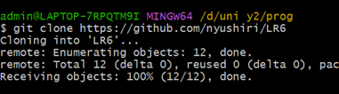
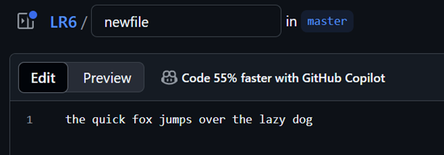
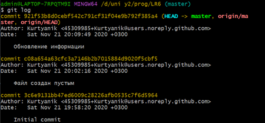
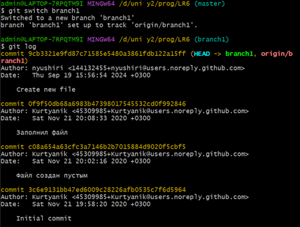
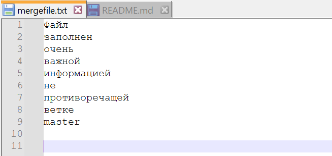
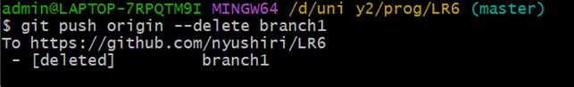

# LR6
###Лабораторная работа №6

**Цель лабораторной работы:** изучение базовых возможностей системы управления версиями, опыт работы с Git Api, опыт работы с локальным и удаленным репозиторием. 

Для начала работы форкаем репозиторий и клонируем его на компьютер (Git уже был установлен).



Создаем файл на гитхабе и поттягиваем изменения с помощью git pull.



Смотрим историю изменения веток.




Для успешного слияния в master ветку разрешаем конфликт.



Удаляем ветку branch1.


Лог команд:
```
git clone
git pull
git log
git switch
git add
git commit
git push
git revert
```
**Вывод:** Я изучил базовые возможности системы управления версиями, получил опыт работы с Git Api и с локальным и удаленным репозиторием.	
