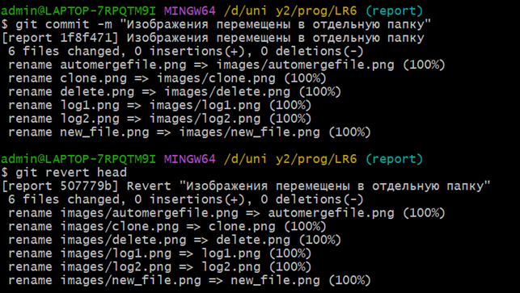

# LR6
Лабораторная работа №6

**Цель лабораторной работы:** изучение базовых возможностей системы управления версиями, опыт работы с Git Api, опыт работы с локальным и удаленным репозиторием. 

Для начала работы форкаем репозиторий и клонируем его на компьютер (Git уже был установлен).


Создаем файл на гитхабе и поттягиваем изменения с помощью git pull.


Смотрим историю изменения веток.


Для успешного слияния в master ветку разрешаем конфликт.


Удаляем ветку branch1.


Пример выполнения команды git revert.



Лог команд:
```
git clone - клонирование репозитория на компьютер
git pull - подтягивание изменений из репозитория
git log - вывод истории коммитов в ветке
git switch - смена ветки
git add - добавление изменений в индекс
git commit - фиксация изменений из индекса
git push - перенос изменений в репозиторий 
git checkout - создание новой ветки
git revert - откат коммита
```

История операций:
```
670b30b 2024-09-19 nyushiri Добавлены комментарии к изображениям
32e197e 2024-09-19 nyushiri Добавлен лог команд
e0efaf5 2024-09-19 nyushiri Добавлены изображения
74f4531 2024-09-19 nyushiri Добавлены цель и вывод
36f269c 2024-09-19 nyushiri Добавлены изображения
93bee76 2024-09-19 nyushiri merging
9cb3321 2024-09-19 GitHub Create new file
921f53b 2020-11-21 GitHub Обновление информации
0f9f50d 2020-11-21 GitHub Заполнил файл
c08a654 2020-11-21 GitHub Файл создан пустым
3c6e913 2020-11-21 GitHub Initial commit
```

**Вывод:** Я изучил базовые возможности системы управления версиями, получил опыт работы с Git Api и с локальным и удаленным репозиторием.	
